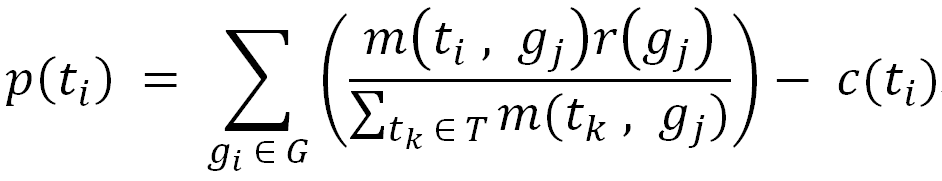

<h1>Introduction to TasksRanking Algorithm</h1>
<h2>And how it guides my daily life!</h2>
<h3>What is it?</h3>

<!-- Explain why as a young man figuring priority is important. -->
TasksRanking is a simple Mathmatical model that ranks tasks based on their priorities. 
Firstly, TasksRanking calculates the profit of tasks by the the cost of each task, revenue of each goal, and how each task impacts each goal. 
Then, TasksRanking regards tasks with high profit as high priorities, and reversely sort tasks by their profit.

<h3>Sample output!</h3>

<!-- Paste the output from sample fake data. Don't leak your privacy! -->
The log below is generated from sample data in the code:
<pre>
task: ensureQualityAndSpeedOfEachTask; revenue: 3.864224137931034; cost:3.0; description: Ensure the quality, quantity, and speed of each tasks you finish, and never rush.
	impact 'haveGoodCareer:10.0' for 0.6551724137931034
	impact 'formStableAndSolidSocialGroups:5.0' for 0.0625
task: talkMoreWithTeamMembersAboutTheirTasks; revenue: 2.870150862068966; cost:1.75; description: Talk with others about there tasks, especially the ones collaborate closely with you. Know scope of each tasks and each ones tasks, know each one's responsibility, communicate first before working on other's responsibilities.
	impact 'haveGoodCareer:10.0' for 0.3448275862068966
	impact 'formStableAndSolidSocialGroups:5.0' for 0.234375
task: dateGirls; revenue: 2.180803571428571; cost:2.75; description: Date girls with the goal of getting married. Try to learn from them and know their ideas.
	impact 'gettingMarried:9.0' for 0.45238095238095233
	impact 'formStableAndSolidSocialGroups:5.0' for 0.171875
task: learnCooking; revenue: 0.6696428571428572; cost:2.0; description: Learn to cook good, nice, and delicious food.
	impact 'gettingMarried:9.0' for 0.2619047619047619
	impact 'formStableAndSolidSocialGroups:5.0' for 0.0625
task: attendSocialActivities; revenue: 0.6629464285714279; cost:2.75; description: Attend off line social activities received from various sources.
	impact 'gettingMarried:9.0' for 0.21428571428571427
	impact 'formStableAndSolidSocialGroups:5.0' for 0.29687499999999994
task: alwaysReadSocialInformation; revenue: -1.2477678571428572; cost:2.75; description: Form the habit of always read social related information from various channels, and extract valuable information relate to social activities.
	impact 'gettingMarried:9.0' for 0.07142857142857142
	impact 'formStableAndSolidSocialGroups:5.0' for 0.171875
</pre>
Pretty simple and amazing right? This means as a young man my priority list is: 
1. Ensure quality and speed of each task at my company 
2. Talk more with team members about their tasks 
3. Date girls 
4. Learn cooking 
5. Attend social activities 
6. Always read social information 

<h3>How it works? Explained in Math!</h3>

<!-- Explain the algorithm and include the Math formula. -->
T: Set of tasks 
G: Set of goals 
t: A task, {t | t ∈ T} 
g: A goal, {g | g ∈ G} 
c(t): Cost of tast t 
r(g): Revenue of goal g 
m(t, g): Impact of task t on goal g 
p(t): Profit gained by performing task t 
 
Then profit of ith task t_i is: 

<h3>How the values come?</h3>

The values of revenues of Goals, costs of Tasks, and impacts of each task on each goal come from the World's most advanced 
<a href="https://en.wikipedia.org/wiki/Artificial_neural_network" target="_blank">Neural Network</a> model -- 
my <a href="https://en.wikipedia.org/wiki/Human_brain" target="_blank">HUMAN BRAIN</a>!
 
I tend to set values of revenues and costs within [0, 10], and values of impacts within [0, 1] based on my own judgement of
importance of Goals, hardship of Tasks, and relationships between Goals and Tasks.
 
The values help me to make comparison between all the Goals and all the Tasks. So when I'm overwhelmed by objectives, 
I can still figure out my priorities very quick by only compare and adjust those values and run my algorithm!

<h3>How it impacts my life?</h3>

In my real life, I have 19 goals and 41 tasks in total. I really can not figure out my priority list easily and make daily plan. So TasksRanking helps me! 
By reading results of TasksRanking while making daily plan, I never feel stress even when
a lot of objectives come to my life concurrently! 
Also, TasksRanking explains the ranking results in number. It explains my motivations to me when I don't understand my actions in the past.  
As a lover of Math, I'm so happy to see my loved Math helps me everyday!!!

<h1>Enjoy It!</h1>
